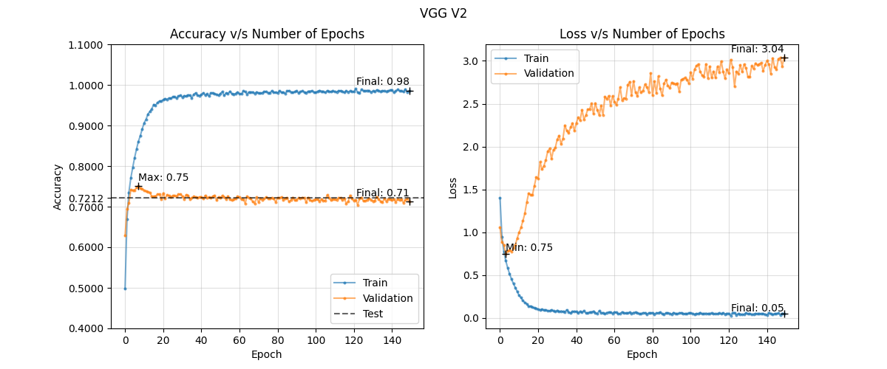
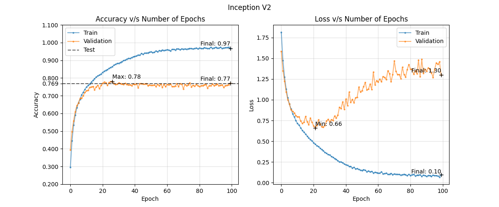

# Image Classification on CIFAR-10 using ConvNets

## Baseline Model  
We tried 8 different architectures for the baseline model: three based on the VGGNet architecture, two based on the GoogLeNet architecture, one each for the ResNet architecture, and two Inception-ResNet architectures.  

### Architectures  
1. The VGG-style models comprised of 1, 2, and 3 conv blocks. 
2. For the Inception-style models, we used 2 conv blocks, following by 1 and 2 inception modules, and used global average pooling. 
3. The ResNet model comprised of a conv block followed by three skip-connected blocks of 2 conv layers each, and used global average pooling. 
4. Inception-ResNet-1 model was a clone of Inception-2, with each block being skip connected and downsampled appropriately using a single Conv2d layer in each skip connection. Inception-ResNet-2 followed the design of the original paper more closely, only using skip connections for the inception module. 

### Training Metric Plots  

### Insights  
From the training metric plots, we can deduce the following:  
1. For the VGG-style models, increasing the number of blocks leads to quicker saturation of the training accuracy, though the validation accuracy of VGG-3 is 15% higher than that of VGG-1.  
2. Replacing the third conv-block for an inception module leads to slower overfitting, which can potentially be better for the validation accuracy. Adding a second inception module leads to a higher validation accuracy.  
3. Using skip connections further improves the training and validation accuracy by 2% each, with a trade-off in overfitting rate.  
4. Skip connecting the inception module however, leads to a drastic drop in the validation accuracy of the model. Removing the skip connections from the conv blocks, leads to a further decrease in the training and validation accuracy.  

From the above metric plots and insights, we chose the ResNet architecture as our baseline model for this dataset.  

## Improved Model
After choosing the ResNet architecture as the baseline, we tried to improve the model's performance.  
1. Simply using dropout did not help much. The architecture was too wide and shallow for CIFAR10.   
2. After this, we reduced the width of the network (using ResNetV2), and experimented with dropout again. In contradiction to Bum Jun Kim et al.'s suggestion, using dropout before the global average pooling (GAP) layer, as compared to the traditional method of placing it after resulted in a drop of about 2% in both the training and validation accuracies to 84.27% and 73.47%.  
3. In order to reduce overfitting further, we increased the depth of the model by doubling the skip-connected blocks to 6 (still smaller than ResNet-20). The final model was trained for 80 epochs using SGD, a learning rate scheduler, data augmentation, and batch normalization. This lead to less overfitting, but slightly higher underfitting, as the training accuracy dropped to 71.32% while the validation accuracy stayed around 72.43%.  

### Training Metric Plot  
  

### Further Improvement  
To further improve the model's predictive powers, ResNet-20 could be replicated by adding 3 more residual blocks.  

## References  

- [Very Deep Convolutional Networks for Large-Scale Image Recognition](https://arxiv.org/abs/1409.1556)  
- [Going Deeper with Convolutions](https://arxiv.org/abs/1409.4842)  
- [Deep Residual Learning for Image Recognition](https://arxiv.org/abs/1512.03385)  
- [Analysis of Dropout](https://pgaleone.eu/deep-learning/regularization/2017/01/10/anaysis-of-dropout/)  
- [How to Use Dropout Correctly on Residual Networks with Batch Normalization](https://arxiv.org/pdf/2302.06112)  