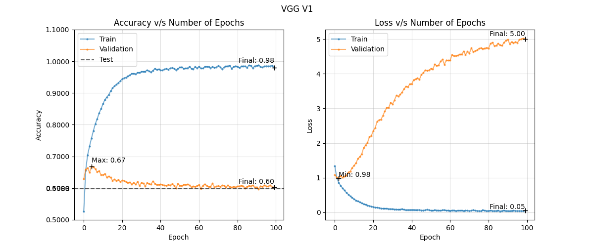

# Image Classification on CIFAR-10 using ConvNets

## Baseline Model
We tried 5 different architectures for the baseline model, three of which were based on the VGGNet architecture, while two were based on the GoogLeNet architecture. The VGG-style models comprised of 1, 2, and 3 conv blocks. For the Inception-style models, we used 2 conv blocks, and then 1 and 2 inception modules. 

From the training metrics, we can deduce the following:  
1. For the VGG-style models, increasing the number of blocks leads to quicker saturation of the training accuracy, though the validation accuracy of VGG-3 is 15% higher than that of VGG-1. 
2. Replacing the third conv-block for an inception module leads to slower training, which can potentially be better for the validation accuracy.
3. Adding a second inception module leads to a higher validation accuracy. 

Since Inception-2 provides the best validation accuracy, we chose Inception-2 as the baseline for further experimentation and training. 
