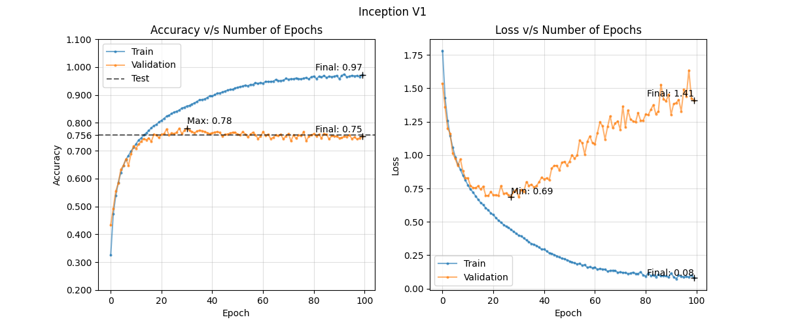

# Image Classification on CIFAR-10 using ConvNets

## Baseline Model  
We tried 8 different architectures for the baseline model: three based on the VGGNet architecture, two based on the GoogLeNet architecture, one each for the ResNet architecture, and two Inception-ResNet architectures.  

### Architectures  
1. The VGG-style models comprised of 1, 2, and 3 conv blocks. 
2. For the Inception-style models, we used 2 conv blocks, following by 1 and 2 inception modules, and used global average pooling. 
3. The ResNet model comprised of a conv block followed by three skip-connected blocks of 2 conv layers each, and used global average pooling. 
4. Inception-ResNet-1 model was a clone of Inception-2, with each block being skip connected and downsampled appropriately using a single Conv2d layer in each skip connection. Inception-ResNet-2 followed the design of the original paper more closely, only using skip connections for the inception module. 

### Training Metric Plots  

### Insights  
From the training metric plots, we can deduce the following:  
1. For the VGG-style models, increasing the number of blocks leads to quicker saturation of the training accuracy, though the validation accuracy of VGG-3 is 15% higher than that of VGG-1. 
2. Replacing the third conv-block for an inception module leads to slower overfitting, which can potentially be better for the validation accuracy. Adding a second inception module leads to a higher validation accuracy. 
3. Using skip connections further improves the training and validation accuracy by 2% each, with a trade-off in overfitting rate. 
4. Skip connecting the inception module however, leads to a drastic drop in the validation accuracy of the model. Removing the skip connections from the conv blocks, leads to a further decrease in the training and validation accuracy. 

From the above metric plots and insights, we chose the ResNet architecture as our baseline model for this dataset. 

## References

https://pgaleone.eu/deep-learning/regularization/2017/01/10/anaysis-of-dropout/